# Abaya Store Management System

The Abaya Store Management System is a web-based application developed using ASP.NET Web Forms, C#, and SQL Server. It provides a complete platform for managing an online abaya store, allowing customers to browse products, place orders, and manage their accounts.

The system includes dedicated dashboards for administrators, customers, and salespersons. Administrators can manage products, inventory, orders, and users, while analytical modules such as customer segmentation and demand forecasting support business decision-making.

## Technologies Used

* ASP.NET Web Forms
* C#
* SQL Server
* HTML
* CSS
* JavaScript

## Screenshots

### Admin Dashboard

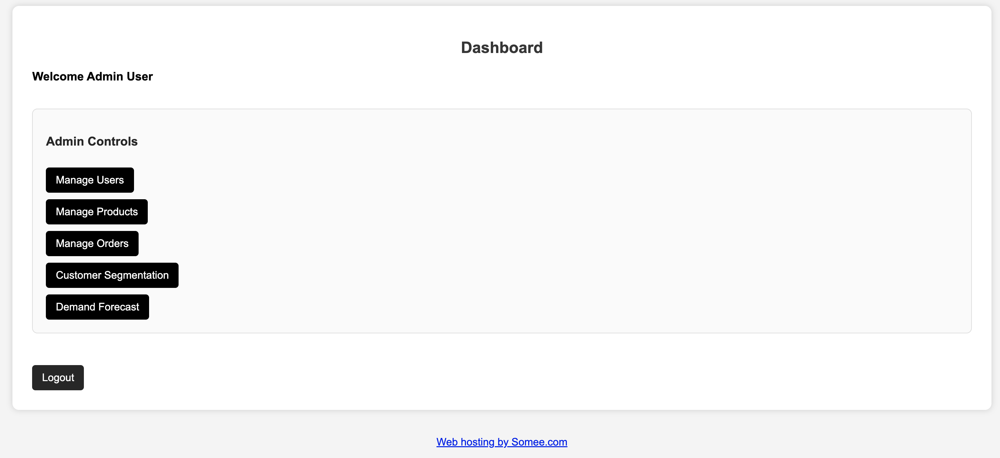

### Customer Segmentation

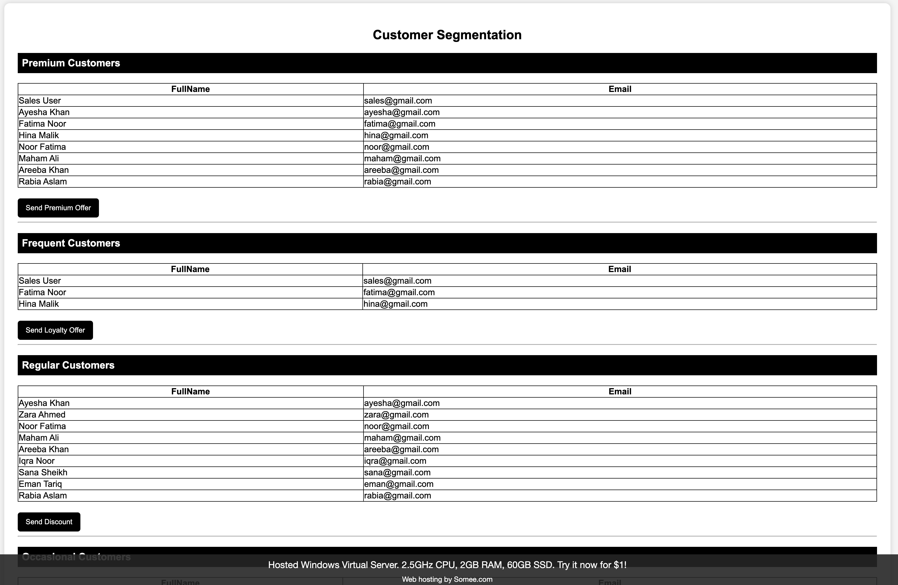

### Demand Forecasting

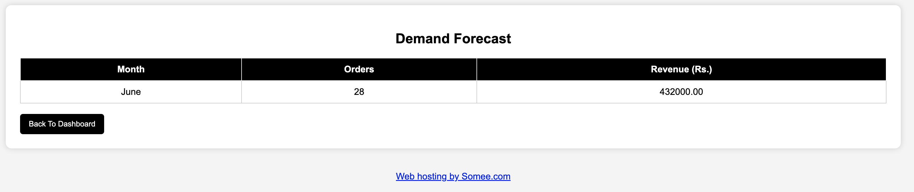

### Manage Orders

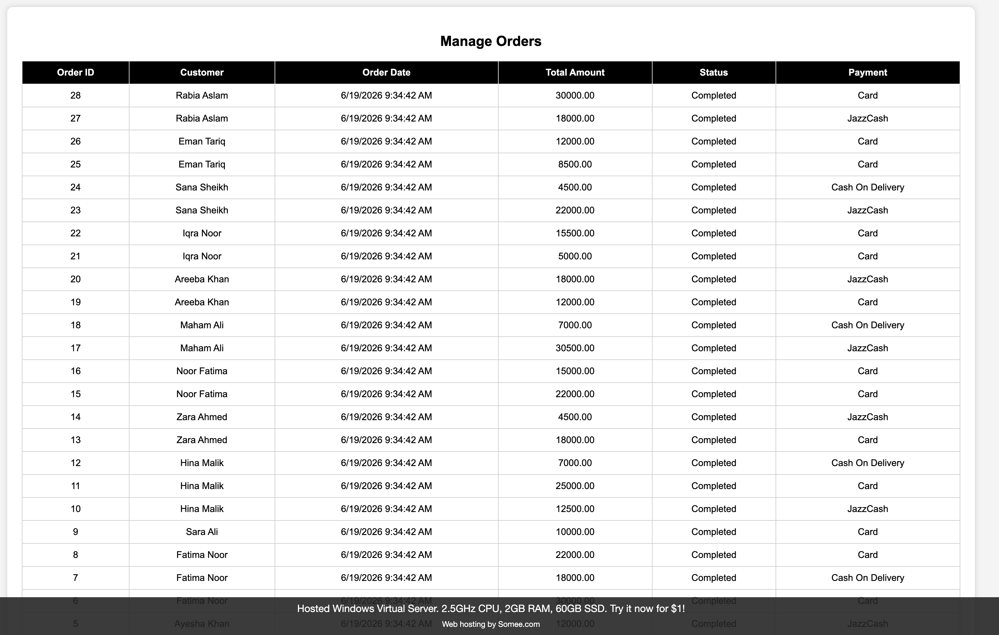

### Manage Products

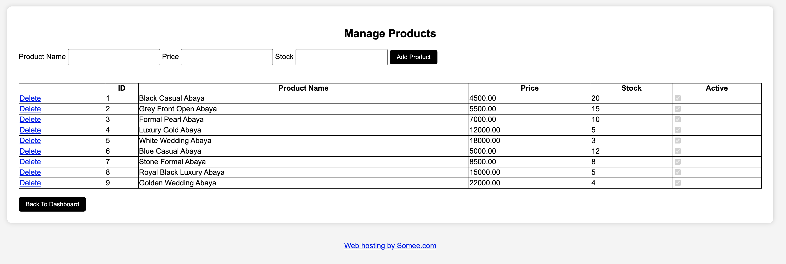

### Manage Users

### Browse Products

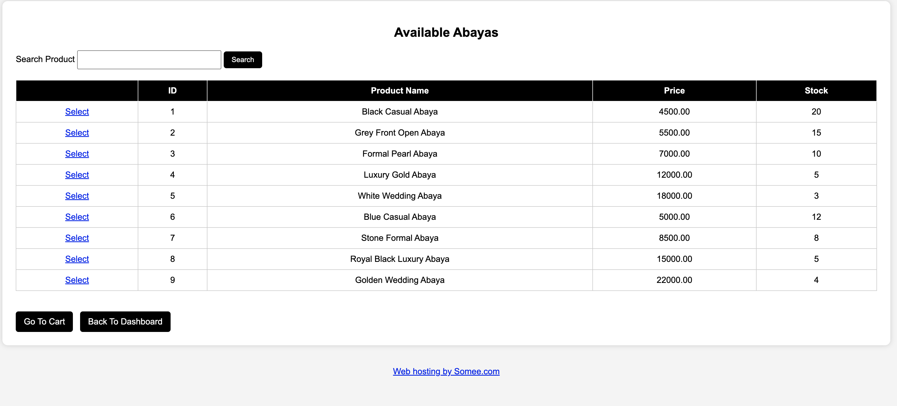

### Customer Dashboard

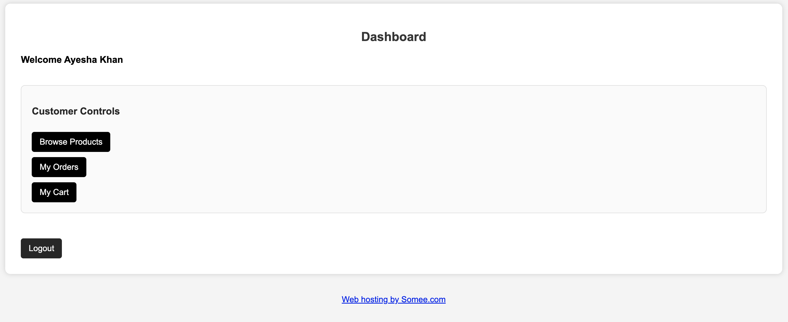

### My Cart

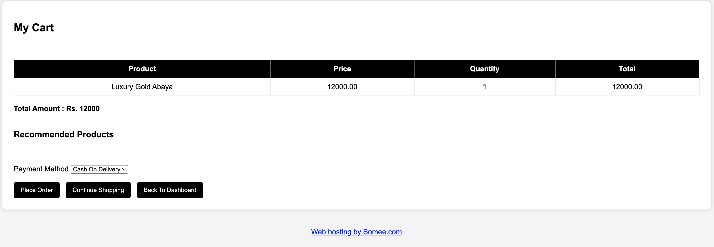

### My Orders

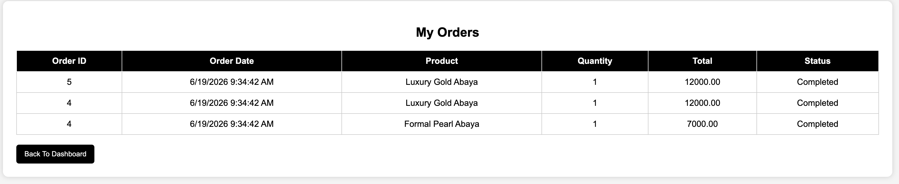

### Login

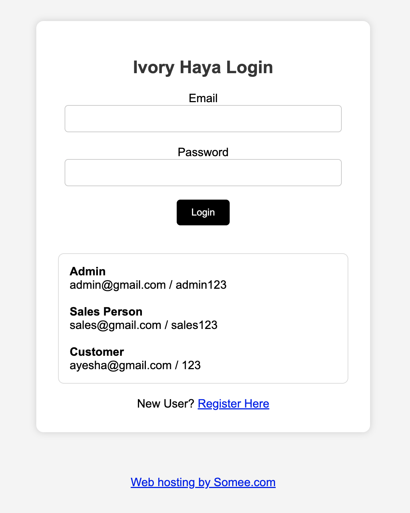

### Salesperson Dashboard

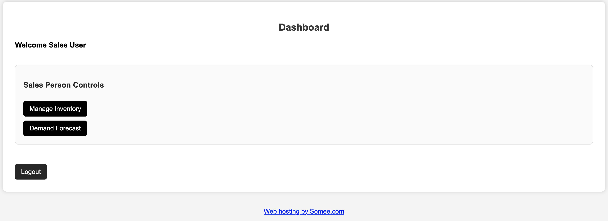

### Salesperson Demand Forecast

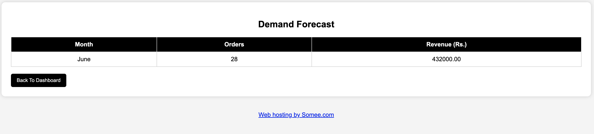

### Salesperson Inventory Management

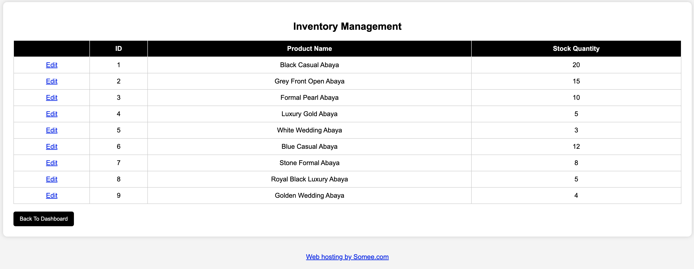

## Live Demo

**Live Website:** [Abaya Store Management System](http://takreemiad.somee.com/Lab%2010%20Project/Login)

